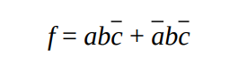
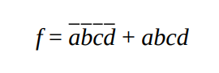
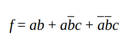
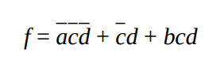

# Exercise 8.2.1
## Question
Use predicates (i) through (iv) to answer the following questions.
i.

ii.

iii.

iv.

(a) Draw the Karnaugh maps for f and -f.

(b) Find the nonredundant prime implicant representation for f and -f.

(c) Give a test set that satisfies Implicant Coverage (IC) for f.

(d) Give a test set that satisfies Multiple Unique True Points (MUTP) for f.

(e) Give a test set that satisfies Corresponding Unique True Point and Near False Point Pair Coverage (CUTPNFP) for f.

(f) Give a test set that satisfies Multiple Near False Points (MNFP) for f.

(g) Give a test set that is guaranteed to detect all faults in Figure 8.2.

## Answer
### a) Draw the Karnaugh maps for f and -f.
**i.**

Karnaugh map for f:  

| c \ ab | 00 | 01 | 11 | 10 |
|--------|----|----|----|----|
|0|    | 1  | 1  |    |
|1|    |    |    |    |

Karnaugh map for -f: 

| c \ ab | 00 | 01 | 11 | 10 |
|--------|----|----|----|----|
|0| 1  |    |    | 1  |
|1| 1  | 1  | 1  | 1  |

**ii.**

Karnaugh map for f:  

| cd \ ab | 00 | 01 | 11 | 10 |
|---------|----|----|----|----|
|00| 1  |    |    |    |
|01|    |    |    |    |
|11|    |    | 1  |    |
|10|    |    |    |    |

Karnaugh map for -f: 

| cd \ ab | 00 | 01 | 11 | 10 |
|---------|----|----|----|----|
|00|    | 1  | 1  | 1  |
|01| 1  | 1  | 1  | 1  |
|11| 1  | 1  |    | 1  |
|10| 1  | 1  | 1  | 1  |

**iii.**

Karnaugh map for f:

| c\ab  | 00 | 01 | 11 | 10 |
|-------|----|----|----|----|
|0|    |    | 1  |    |
|1| 1  |    | 1  | 1  |

Karnaugh map for (-f):

| c\ab  | 00 | 01 | 11 | 10 |
|-------|----|----|----|----|
|0| 1  | 1  |    | 1  |
|1|    | 1  |    |    |

**iv.**

Karnaugh map for f:

|    | 00 | 01 | 11 | 10 |
|----|----|----|----|----|
| 00 | 1  | 1  |    |    |
| 01 | 1  | 1  | 1  | 1  |
| 11 |    | 1  | 1  |    |
| 10 |    |    |    |    |

Karnaugh map for (-f):

|    | 00 | 01 | 11 | 10 |
|----|----|----|----|----|
| 00 |    |    | 1  | 1  |
| 01 |    |    |    |    |
| 11 | 1  |    |    | 1  |
| 10 | 1  | 1  | 1  | 1  |

### b. Find the nonredundant prime implicant representation for f and -f
**i.**

- For f: f = b(-c)  
- For -f: -f = (-b) + c 

**ii.**

- For f: f = (-a)(-b)(-c)(-d) + abcd  
- For -f: -f = (-a)d + c(-d) + b(-c) + a(-b)

**iii.**

- For f : ab + (-b)c
- For (-f): (-a)b + (-b)(-c)

**iv.**

- For f : (-a)(-c) + bd + (-c)d
- For (-f) : a(-d) + c(-d) + (-b)c

### c. Give a test set that satisfies Implicant Coverage (IC) for f.
**i.**

Implicants: {(-b), c, b(-c)}  
T = {xTF, xFT}

**ii.**

- Implicants: {(-a)(-b)(-c)(-d), abcd, (-a)d, c(-d), b(-c), a(-b)}  
- T = {FFFF, TTTT, FTFT, TFTF}

**iii.**

- Implicants: (-b)c, (-a)b, (-b)(-c)}  
- T = {TT-, -FT, FT-, -FF}

**iv.**

- Implicants: {(-a)(-c), bd, (-c)d, a(-d), c(-d), (-b)c}  
- T = {FTFT, TFTF}

### d. Give a test set that satisfies Multiple Unique True Points (MUTP) for f.
**i.**

T = {-TF,-FF,-TT}

**ii.**

T = {FFFF, TTTT, FFTT, FTTF, FTFT, TFFT}

**iii.**

T = {TT-, -FT, FT-, -FF}

**iv.**

T = {F-FF, -TTT, TFFT, T-FF, FTTF, -FTT}

### e. Give a test set that satisfies Corresponding Unique True Point and Near False Point Pair Coverage (CUTPNFP) for f
**i.**

- UTPs: {-TF}  
- NFPs: {-TT, -FF}  
- Test set {-TF, -TT, -FF} would also satisfy CUTPNFP.

**ii.**

- UTPs: {FFFF, TTTT, FFTT, FTTF, FTFT, TFFT}

**iii.**

- UTPs: {TTF, FFT}  
- NFPs: {FTF,TFF}, {FFF,FTT}   
- {TTF, FTF, TFF} and {FFT, FFF, FTT} would satisfy CUTPNFP.  

**iv.**

- UTPs: {FFFF, TTTT, TFFT}  
- NFPs: {TFFF,FFTF}, {TFTT,TTTF}, {TFTT,TFFF}  
- {FFF,TFFF,FFTF}, {TTTT,TFTT,TTTF} and {TFFT,TFTT,TFFF} would satisfy CUTPNFP.
